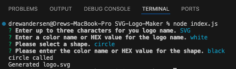
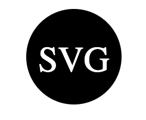

# SVG-Logo-Maker

## Video link 
** Link for walkthrough video **

## Images

## Table of Contents
- [Description](#description)
- [Installation](#installation)
- [Usage](#usage)
- [License](#license)

## Description
An application to make it easy to create and SCG logo by answering command line questions using node.js.

## Installation
This application requires node.js to be installed on your local machine. The user can go to https://nodejs.org/en to download node.js. 

## Usage
In order to use this application the user must have node.js installed on their machine. The user can then clone down this repository or copy the contents of the repository to their machine. Once the repository is cloned down open the terminal and type in 'node index.js'. This will prompt the user to answer four questions: what three letters they would like for their logo to have, the color of the letters, what shape the user would like to have (triangle, circle, or square), and what color they would like the shape to be. Then the application will make a logo for the user.

## License

## Contribute
N/A

## Tests
The tests cover the render function of the individual shape classes, comparing the output to the expected output.